# Comparing AWS and Azure

## Resource Groups

- In `Azure`, all resources are grouped into resource groups.
- In `AWS`, the use of resource groups is optional.

## Public IP Address

- In `Azure`, the default setting is `static`.
- In `AWS`, the default setting is `dynamic` (changes every time you restart VM).

## Terminology

- Launch instance = Create VM

## Key Pair

AWS creates a key pair for you, keeps the public key, and makes you download the private key.

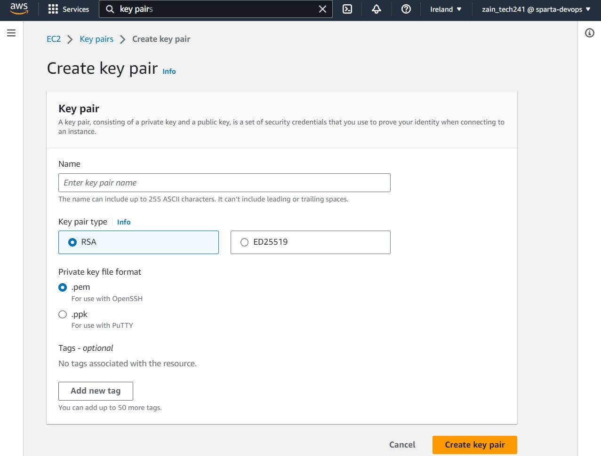

# What is DevOps?

DevOps is a set of practices that combines software development and IT operations. It aims to shorten the system development life cycle and provide continuous delivery with high software quality. DevOps is complementary with Agile software development; several DevOps aspects came from Agile methodology.

# Public IP vs Private IP in AWS

## Pros and Cons

### Public IP

- **Pros:**

  - Directly accessible over the internet, which can be beneficial for services that need to be publicly available.
  - No need for VPN or AWS Direct Connect to access the resources.

- **Cons:**
  - Being accessible over the internet means it's exposed to potential threats.
  - May incur additional costs as data transfer rates apply.

### Private IP

- **Pros:**

  - Not directly accessible over the internet, providing an additional layer of security.
  - Ideal for internal services that don't need to be exposed to the public internet.

- **Cons:**
  - Requires VPN or AWS Direct Connect for access from outside the network, which can add complexity and cost.

## Diagram Illustrating Public and Private IP for VMs in VNet

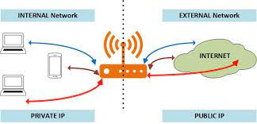

When interacting with a VM from an external source, the public IP address is typically utilized. However, when connecting two VMs, the public database IP address has been the default method. This approach has a significant drawback: the public IP address changes frequently, which hinders automation. Using a public IP address is akin to exiting and re-entering a building, which means you lose your 'trusted' status and must comply with Network Security Group (NSG) rules.

To address this issue, the private IP address can be used. This allows the Network Interface Cards (NICs) in the two VMs to communicate directly. As a result, the machines can trust each other, bypassing the need for NSG rules. Consequently, there's no longer a need for the 27017 port rule. The private IP address should be used in the environment variable. It's important to note that this method is only effective if both VMs are located within the same virtual network.

# Creating a VM

## Choose Region

- Has to be set to Ireland for Sparta training

## Choose Image

- AMI = Amazon Machine Image - used to make an identical copy of VM - ami-0a7493ba2bc35c1e9 (the one we use (18.04 lts 1e9))

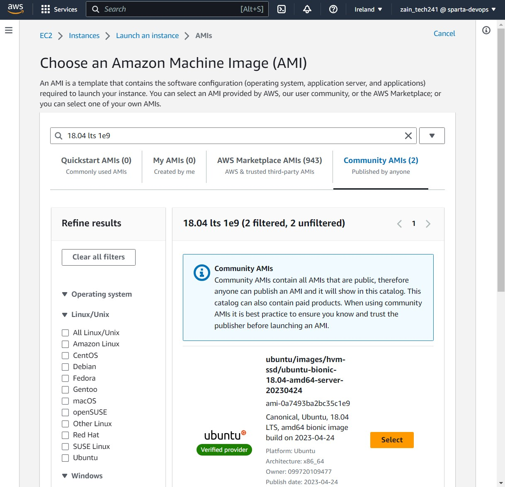

## Choose Key & Security Group

- Next, you choose your key pair to SSH into your VM. Use the global tech241 public key and the private one is in the local .ssh folder.
- **Security Group:** Allows SSH, Port 27017 as inbound rules

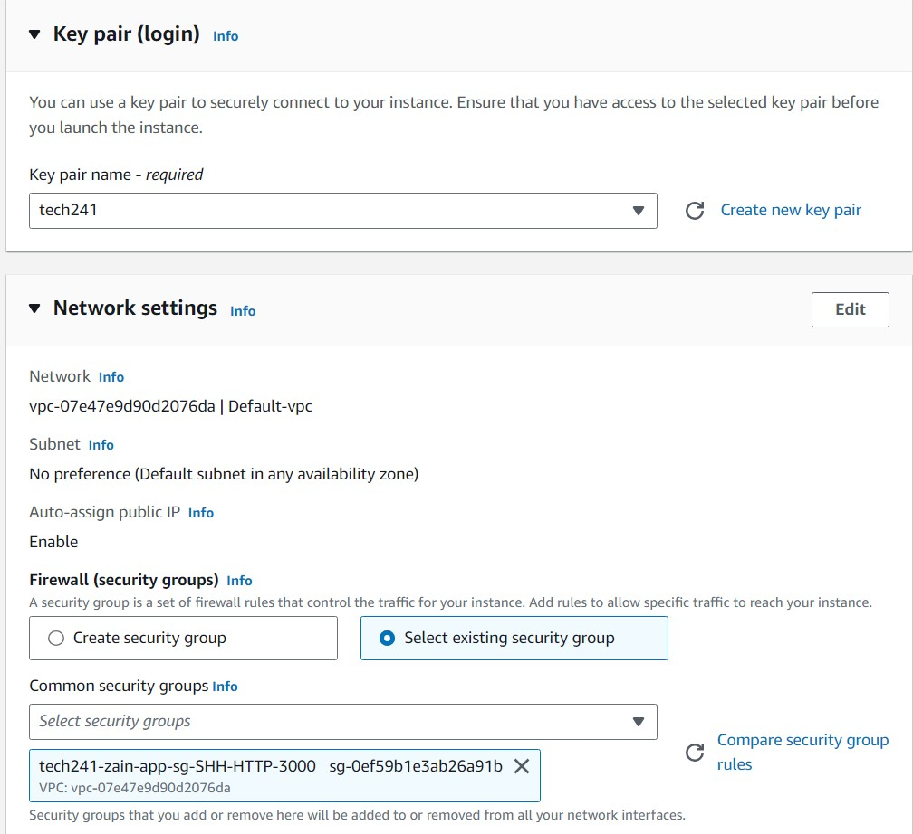

## Finalize

- Once you have completed the setup, you can search for your VMs using thesearch bar.
- You can also delete your instance (known as VM) on this menu as well as seen in this image.
- 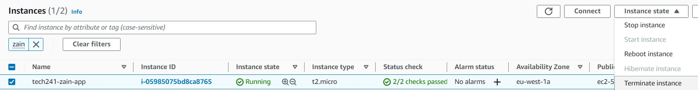

## SSH into VM

- SSH commands are shown in this image. Here is an example of a command to log in ssh -i `"~/.ssh/tech241.pem" ubuntu@ec2-54-246-226-45.eu-west-1.compute.amazonaws.com`
- 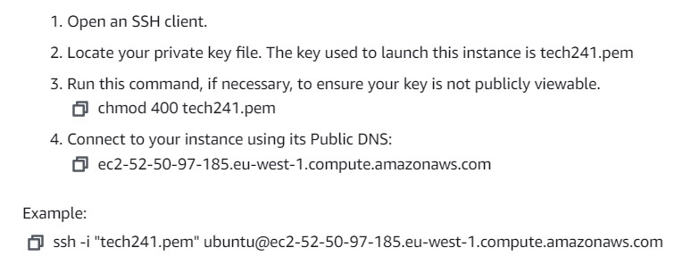

# MongoDB Script

- After you create a DB VM, run the DB script.
- Check the DB is running by using `sudo systemctl status mongod`. You should get a output like this image.
  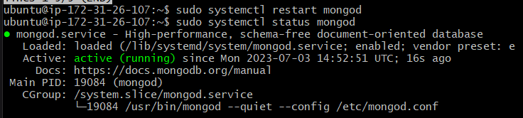
- Next run `sudo cat /etc/mongod.conf` and make sure the BindIP has changed to resemble this image.
  

# App Script

- After you create an App VM, change this IP address to match your own DB IP in the app script `

# Define the DB_HOST variable

- export DB_HOST=52.214.194.115:27017/posts`
- If the script ran correctly it should look like this image at the end of your command line.
  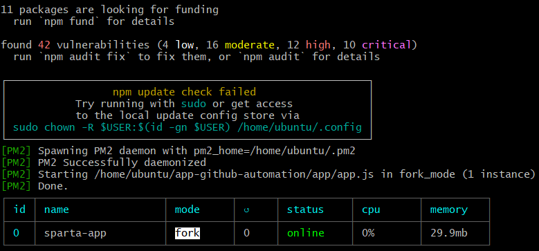
- Run the Script
- Run this command and check if the proxy has been changed correctly `sudo nano /etc/nginx/sites-available/default`
- It should look like this image
  

User data: auto runs the script for only one time when the VM instance gets started and running. Root user so no need for sudo commands. Under advanced details section 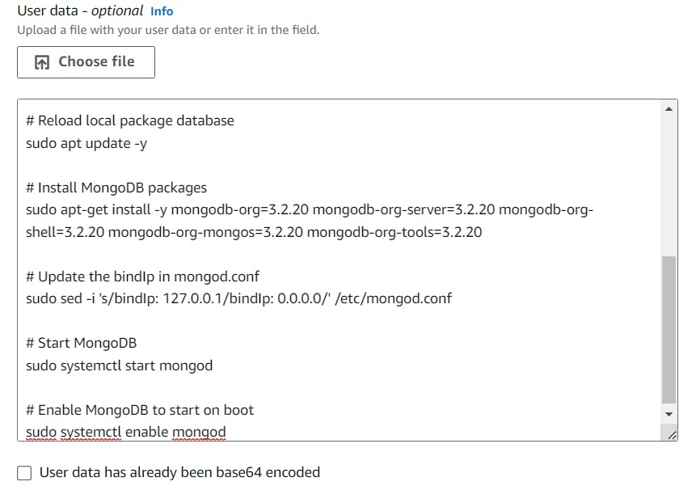

Create an image: This is how you create an image 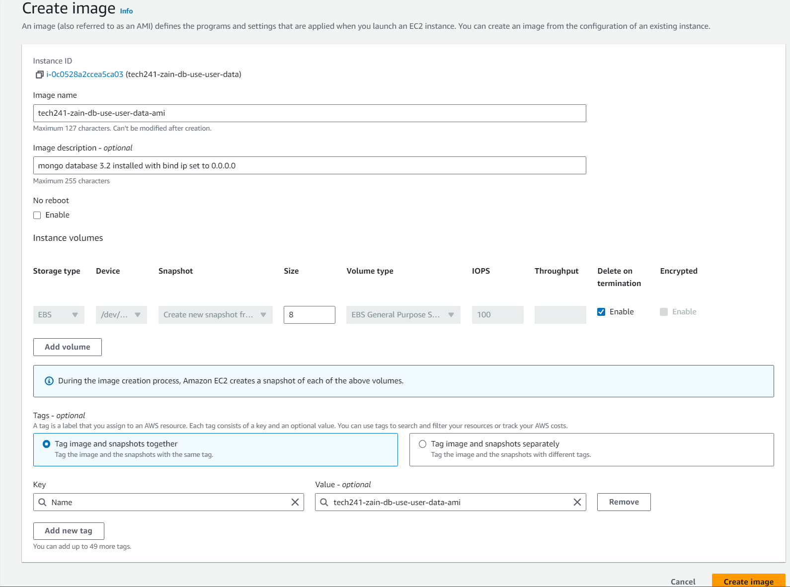

# Amazon Machine Images (AMIs)

## Introduction

An Amazon Machine Image (AMI) is a template that contains a software configuration (for example, an operating system, an application server, and applications). From an AMI, you launch instances, which are copies of the AMI running as virtual servers in the cloud. You can launch multiple instances from a single AMI when you need multiple instances with the same configuration.

## Why Create an AMI?

Creating your own AMI allows you to:

1. **Launch instances quickly**: Once you have an AMI, you can launch new instances whenever you need them.
2. **Preserve your instance configuration**: If you have spent time configuring an instance to meet your needs, you can create an AMI from it to avoid doing the same setup in the future.
3. **Control and maintain your software**: AMIs allow you to manage your own set of custom software for your projects.
4. **Share software with others**: You can share your AMIs with other AWS accounts or make them public.

## How to Create an AMI

Here are the general steps to create an AMI from an Amazon EC2 instance:

1. Open the Amazon EC2 console at https://console.aws.amazon.com/ec2/.
2. In the navigation pane, choose 'Instances'.
3. Select the instance that you want to create an AMI of.
4. Choose 'Actions', then choose 'Create Image'.
5. In the 'Create Image' dialog box, type a unique name and description, and choose 'Create Image'.
6. After the process completes, the AMI is available for use.

# Setting Up a Dashboard and CPUUsage Alarm in AWS

## Introduction

This document provides a step-by-step guide on how to set up a dashboard and create a CPU usage alarm for an EC2 instance in AWS. It also includes instructions on how to receive a notification via email when the alarm is triggered.

## Setting Up a Dashboard

1. Open the AWS Management Console.
2. Navigate to the CloudWatch service.
3. In the navigation pane, click on 'Dashboards'.
4. Click on 'Create dashboard'.
5. Enter a name for the dashboard and click on 'Create'.
6. On the new dashboard screen, click on 'Add widget'.
7. Select the type of widget you want to add (e.g., line, stacked area, number, text, etc.).
8. Configure the widget as per your requirements and click on 'Create widget'. At the end it should look like this image.
   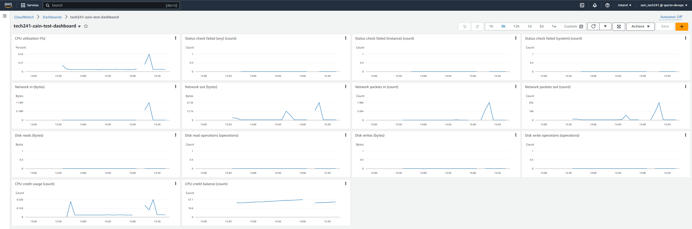

## Creating a CPU Usage Alarm

1. In the CloudWatch service, click on 'Alarms' in the navigation pane.
2. Click on 'Create alarm'.
3. Click on 'Select metric'.
4. In the 'All metrics' tab, select 'EC2 metrics'.
5. Find the instance you want to monitor and select the checkbox next to the 'CPUUtilization' metric.
6. Click on 'Select metric'.
7. Under 'Conditions', configure the alarm to trigger when the average CPU utilization is greater than a specified threshold (e.g., 7%) for a specified number of periods (e.g., 1 minute). Should look like this image.
   

8. Click on 'Next'.
9. Under 'Notification', select 'In alarm' and choose an SNS topic to notify when the alarm is in the 'ALARM' state.
   Should look like this image.
   
10. Click on 'Next', enter a name and description for the alarm, and click on 'Create alarm'.
    Should look like this image.
    

## Receiving a Notification

When the CPU usage alarm is triggered, a notification will be sent to the email address associated with the SNS topic you selected. The email will contain details about the alarm and the current state of your EC2 instance. The email should look like this
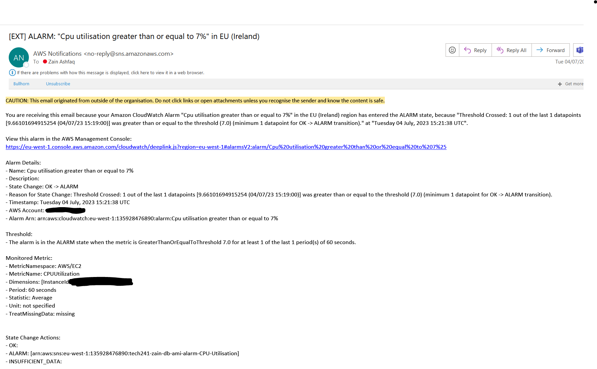

## Testing the Alarm

You can test the alarm by SSHing into your EC2 instance and running commands like `apt update/upgrade` to increase CPU usage.
