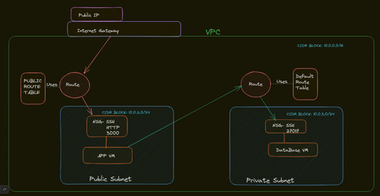
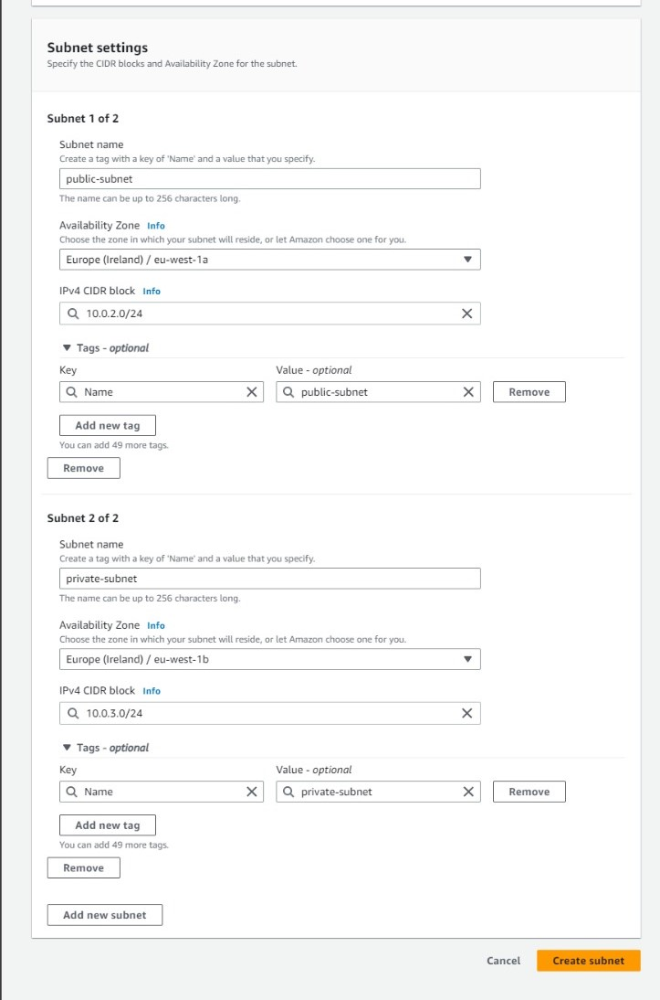
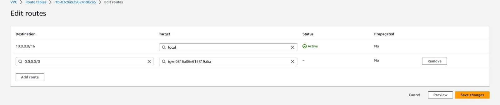

# Comparing AWS and Azure

## Resource Groups

- In `Azure`, all resources are grouped into resource groups.
- In `AWS`, the use of resource groups is optional.

## Public IP Address

- In `Azure`, the default setting is `static`.
- In `AWS`, the default setting is `dynamic` (changes every time you restart VM).

## Terminology

- Launch instance = Create VM
- S3 bucket = blob storage

## Key Pair

AWS creates a key pair for you, keeps the public key, and makes you download the private key.


# What is DevOps?

DevOps is a set of practices that combines software development and IT operations. It aims to shorten the system development life cycle and provide continuous delivery with high software quality. DevOps is complementary with Agile software development; several DevOps aspects came from Agile methodology.

# Public IP vs Private IP in AWS

## Pros and Cons

### Public IP

- **Pros:**

  - Directly accessible over the internet, which can be beneficial for services that need to be publicly available.
  - No need for VPN or AWS Direct Connect to access the resources.

- **Cons:**
  - Being accessible over the internet means it's exposed to potential threats.
  - May incur additional costs as data transfer rates apply.

### Private IP

- **Pros:**

  - Not directly accessible over the internet, providing an additional layer of security.
  - Ideal for internal services that don't need to be exposed to the public internet.

- **Cons:**
  - Requires VPN or AWS Direct Connect for access from outside the network, which can add complexity and cost.

## Diagram Illustrating Public and Private IP for VMs in VNet


When interacting with a VM from an external source, the public IP address is typically utilized. However, when connecting two VMs, the public database IP address has been the default method. This approach has a significant drawback: the public IP address changes frequently, which hinders automation. Using a public IP address is akin to exiting and re-entering a building, which means you lose your 'trusted' status and must comply with Network Security Group (NSG) rules.

To address this issue, the private IP address can be used. This allows the Network Interface Cards (NICs) in the two VMs to communicate directly. As a result, the machines can trust each other, bypassing the need for NSG rules. Consequently, there's no longer a need for the 27017 port rule. The private IP address should be used in the environment variable. It's important to note that this method is only effective if both VMs are located within the same virtual network.

# Creating a VM

## Choose Region

- Has to be set to Ireland for Sparta training

## Choose Image

- AMI = Amazon Machine Image - used to make an identical copy of VM - ami-0a7493ba2bc35c1e9 (the one we use (18.04 lts 1e9))


## Choose Key & Security Group

- Next, you choose your key pair to SSH into your VM. Use the global tech241 public key and the private one is in the local .ssh folder.
- **Security Group:** Allows SSH, Port 27017 as inbound rules


## Finalize

- Once you have completed the setup, you can search for your VMs using thesearch bar.
- You can also delete your instance (known as VM) on this menu as well as seen in this image.
- 

## SSH into VM

- SSH commands are shown in this image. Here is an example of a command to log in ssh -i `"~/.ssh/tech241.pem" ubuntu@ec2-54-246-226-45.eu-west-1.compute.amazonaws.com`
- 

# MongoDB Script

- After you create a DB VM, run the DB script.
- Check the DB is running by using `sudo systemctl status mongod`. You should get a output like this image.
  
- Next run `sudo cat /etc/mongod.conf` and make sure the BindIP has changed to resemble this image.
  

# App Script

- After you create an App VM, change this IP address to match your own DB IP in the app script `

# Define the DB_HOST variable

- export DB_HOST=52.214.194.115:27017/posts`
- If the script ran correctly it should look like this image at the end of your command line.
  
- Run the Script
- Run this command and check if the proxy has been changed correctly `sudo nano /etc/nginx/sites-available/default`
- It should look like this image
  

User data: auto runs the script for only one time when the VM instance gets started and running. Root user so no need for sudo commands. Under advanced details section 

Create an image: This is how you create an image 

# Amazon Machine Images (AMIs)

## Introduction

An Amazon Machine Image (AMI) is a template that contains a software configuration (for example, an operating system, an application server, and applications). From an AMI, you launch instances, which are copies of the AMI running as virtual servers in the cloud. You can launch multiple instances from a single AMI when you need multiple instances with the same configuration.

## Why Create an AMI?

Creating your own AMI allows you to:

1. **Launch instances quickly**: Once you have an AMI, you can launch new instances whenever you need them.
2. **Preserve your instance configuration**: If you have spent time configuring an instance to meet your needs, you can create an AMI from it to avoid doing the same setup in the future.
3. **Control and maintain your software**: AMIs allow you to manage your own set of custom software for your projects.
4. **Share software with others**: You can share your AMIs with other AWS accounts or make them public.

## How to Create an AMI

Here are the general steps to create an AMI from an Amazon EC2 instance:

1. Open the Amazon EC2 console at https://console.aws.amazon.com/ec2/.
2. In the navigation pane, choose 'Instances'.
3. Select the instance that you want to create an AMI of.
4. Choose 'Actions', then choose 'Create Image'.
5. In the 'Create Image' dialog box, type a unique name and description, and choose 'Create Image'.
6. After the process completes, the AMI is available for use.

# Setting Up a Dashboard and CPUUsage Alarm in AWS

## Introduction

This document provides a step-by-step guide on how to set up a dashboard and create a CPU usage alarm for an EC2 instance in AWS. It also includes instructions on how to receive a notification via email when the alarm is triggered.

## Setting Up a Dashboard

1. Open the AWS Management Console.
2. Navigate to the CloudWatch service.
3. In the navigation pane, click on 'Dashboards'.
4. Click on 'Create dashboard'.
5. Enter a name for the dashboard and click on 'Create'.
6. On the new dashboard screen, click on 'Add widget'.
7. Select the type of widget you want to add (e.g., line, stacked area, number, text, etc.).
8. Configure the widget as per your requirements and click on 'Create widget'. At the end it should look like this image.
   

## Creating a CPU Usage Alarm

1. In the CloudWatch service, click on 'Alarms' in the navigation pane.
2. Click on 'Create alarm'.
3. Click on 'Select metric'.
4. In the 'All metrics' tab, select 'EC2 metrics'.
5. Find the instance you want to monitor and select the checkbox next to the 'CPUUtilization' metric.
6. Click on 'Select metric'.
7. Under 'Conditions', configure the alarm to trigger when the average CPU utilization is greater than a specified threshold (e.g., 7%) for a specified number of periods (e.g., 1 minute). Should look like this image.
   

8. Click on 'Next'.
9. Under 'Notification', select 'In alarm' and choose an SNS topic to notify when the alarm is in the 'ALARM' state.
   Should look like this image.
   
10. Click on 'Next', enter a name and description for the alarm, and click on 'Create alarm'.
    Should look like this image.
    

## Receiving a Notification

When the CPU usage alarm is triggered, a notification will be sent to the email address associated with the SNS topic you selected. The email will contain details about the alarm and the current state of your EC2 instance. The email should look like this


## Testing the Alarm

You can test the alarm by SSHing into your EC2 instance and running commands like `apt update/upgrade` to increase CPU usage.

# AWS CLI Commands

1. Install AWS CLI:

   ```bash
   pip install awscli
   ```

2. Configure AWS:

   ```bash
   aws configure
   ```

3. List all S3 buckets:

   ```bash
   aws s3 ls
   ```

   

4. Create a new S3 bucket:

   ```bash
   aws s3 mb s3://tech241-zain-bucket --region eu-west-1
   ```

5. Copy a file to the S3 bucket:

   ```bash
   aws s3 cp test-file.txt s3://tech241-zain-bucket
   ```

6. Sync local directory with S3 bucket:

   ```bash
   aws s3 sync s3://tech241-zain-bucket s3_download
   ```

7. Remove a file from the S3 bucket:

   ```bash
   aws s3 rm s3://tech241-zain-bucket/test-file.txt
   ```

8. Remove all files from the S3 bucket:

   ```bash
   aws s3 rm s3://tech241-zain-bucket --recursive
   ```

9. Remove the S3 bucket:
   ```bash
   aws s3 rb s3://tech241-zain-bucket
   ```

# Create s3 bucket

```python
# first thing is to import boto3 library

import boto3

# set up an s3 connection
s3 = boto3.client('s3')

# create a bucket, in the eu-west-1 region
bucket_name = s3.create_bucket(Bucket="tech241-zain-python-bucket", CreateBucketConfiguration={"LocationConstraint":"eu-west-1"})
# print bucket name to confirm working script
print(bucket_name)


```

# Upload to bucket

```python
# Import boto3 library
import boto3

# Set up an S3 connection
s3 = boto3.client('s3')

# Specify the file name and path
file_name = "D:/Zain Sparta Global/tech241/cloud/aws/s3_buckets/test-file.txt"

# Upload the file to the bucket
upload_bucket = s3.upload_file(file_name, 'tech241-zain-python-bucket', 'test-file-from-script5.txt')

print(upload_bucket)
```

# Read all item names and contents in bucket

```python
# Import boto3 library
import boto3

# Set up an S3 connection
s3 = boto3.client('s3')

# List all objects in the bucket
response = s3.list_objects(Bucket='tech241-zain-python-bucket')
for file_name in response['Contents']:
    print(file_name["Key"])
    obj = s3.get_object(Bucket='tech241-zain-python-bucket', Key=file_name["Key"])

    # Read the content of the file
    file_content = obj['Body'].read().decode('utf-8')

    # Print the content of the file
    print(file_content)
```

# Download file

```python
# Import boto3
import boto3

# set the s3 connection
s3 = boto3.client("s3")

# download the file
download_file = s3.download_file("tech241-zain-python-bucket", "test-file-from-script5.txt", "hasitworked.txt")

print(s3.download_file)
```

# Delete file in bucket

```python
# Import boto3 library
import boto3

# Set up an S3 connection
s3 = boto3.client('s3')

# Specify the bucket name and the file name
bucket_name = 'tech241-zain-python-bucket'
file_name = 'test-file-from-script.txt'

# Delete the file from the bucket
s3.delete_object(Bucket=bucket_name, Key=file_name)

print(f'File {file_name} deleted successfully from bucket {bucket_name}.')
```

# Delete bucket

```python
# Import boto3 library
import boto3

# Set up an S3 connection
s3 = boto3.resource('s3')

# Specify the bucket name
bucket_name = 'tech241-zain-python-bucket'

# Create a bucket resource
bucket = s3.Bucket(bucket_name)

# Delete all objects in the bucket
bucket.objects.all().delete()

# Delete the bucket
bucket.delete()

print(f'Bucket {bucket_name} has been deleted')
```

# AWS Auto Scaling

AWS Auto Scaling is a service that automatically adjusts resources to maintain performance for applications hosted in the Amazon Web Services (AWS) cloud. Auto Scaling can scale up by adding more resources (like RAM or a better CPU) or scale out by creating more instances on demand. When demand decreases, it can scale in by removing or terminating unnecessary instances.

## Scaling Up vs Scaling Out

- **Scale Up**: This involves adding more resources to your existing instances. For example, you might add more RAM or upgrade to a better CPU. This is like moving your workload to a bigger, more powerful machine.

- **Scale Out**: This involves creating more instances on demand. When demand decreases, it scales in by removing or terminating unnecessary instances.


## Auto Scaling Group (ASG)

In AWS, you have an Auto Scaling Group (ASG) which is a collection of EC2 instances that share similar characteristics and are treated as a logical grouping for the purposes of instance scaling and management.

**Pros of ASG**:

- **Scalability**: ASG allows your applications to handle increase in traffic by allowing the capacity to increase or decrease automatically according to conditions you define.
- **High Availability**: ASG can ensure your application has the right amount of capacity to handle the traffic. You can also configure ASG to distribute instances across multiple Availability Zones in a region, which can improve the availability of your application.

The process of setting up an ASG involves creating a launch template, which specifies the instance configuration for the instances in the group. The ASG uses this launch template to launch instances.

## Launch Template

A launch template is a configuration file that specifies the instance configuration for the instances in the group. This includes details such as Network Security Group (NSG) rules, user data, key pair, etc. The ASG uses this launch template to know all the details in order to create a VM.

## Scaling Policy

A scaling policy is a defined rule that the ASG follows to determine when to create new instances. For example, a policy might state that when the CPU load reaches 50%, a new instance should be launched. The policy also specifies the minimum number of instances that should be running, the desired number of instances, and the maximum number of instances that can be created.

## Load Balancer

A load balancer distributes incoming application traffic across multiple targets, such as EC2 instances, in multiple Availability Zones. This increases the availability and fault tolerance of your applications. The load balancer serves as a single point of contact for clients, which increases the availability of your application. You can add and remove instances from your load balancer as your needs change, without disrupting the overall flow of requests to your application.

## High Availability with ASG

To make the ASG have high availability, we can set it to make the VMs in different zones. For example, there are three availability zones inside the Ireland region on AWS. If it had to create more VMs, it would just continue to loop through the three availability zones in the region. If you delete a VM and the ASG goes below the minimum, the ASG will make another one to meet the minimum.

## Monitoring with CloudWatch

AWS CloudWatch can be used to monitor the performance of your instances. You can set up alarms to notify you when certain thresholds are reached, such as high CPU utilization. This can help you to respond quickly to changes in demand and ensure that your instances are performing optimally.

## Cost Considerations

When setting up your ASG, you should consider the cost implications. You can set the maximum number```markdown
of instances that can be running to control your costs. The business needs to decide how much they want to be spending, and can set the max accordingly.

## Traffic Management

We have traffic coming in (example: from the internet), connecting to our app. This connects to the Load Balancer. The ASG creates VMs based on the minimum amount specified. The load balancer balances the load between the existing VMs. This setup ensures that your application can handle varying levels of traffic and provides high availability.

# VPC


stands for Virtual Private/Public Cloud

VPC is like a house - can have own house = private

Internet Gateway - door to enter house (vpc)

Inside VPC, you have public and private subnet
Public subnet - put app vm inside it
Private subnet - put app vm inside it

Router - routes traffic to certain places - Traffic comes from IG to router then router routes traffic depending on the routes we set up - Uses route table to toute to public subnet

Public route table - stores the routes needed to get to App VM

default route table - allows internal communcation between app and db VM

SSH into DB - You SSH into App VM and then on that VM you ssh into the DB vm because DB vm is in a private subnet

# AWS VPC Setup

Here is a breif diagram to showcase everything that could be set up in a VPC.

## Internet Gateway

An Internet Gateway (IGW) is a horizontally scaleable, redundant, and highly available VPC component that allows communication between instances in your VPC and the internet.

**Steps to create and attach an Internet Gateway:**

1. In the VPC Dashboard, go to 'Internet Gateways', then click 'Create internet gateway'.
2. Give it a name, then click 'Create'.
3. Select your newly created IGW, click 'Actions', then 'Attach to VPC'.
4. Select your VPC and confirm.

## Subnets

A subnet is a range of IP addresses in your VPC. You can launch AWS resources into a subnet that you select.

**Steps to create a Public Subnet:**

1. In the VPC Dashboard, go to 'Subnets', then click 'Create subnet'.
2. Select your VPC, give your subnet a name, select an availability zone, and specify the IPv4 CIDR block for the subnet.
3. After creating the subnet, select it, go to the 'Subnet Actions', and click 'Modify auto-assign IP settings'.
4. Check the 'Auto-assign IPv4' box (this ensures that your instances in this subnet will be assigned a public IP address).

**Steps to create a Private Subnet:**

Repeat the same steps as the public subnet, but do not enable 'Auto-assign IPv4'.

## Security Groups

A security group acts as a virtual firewall for your instance to control inbound and outbound traffic.

**Steps to create a Security Group for your application VM:**

1. In the EC2 Dashboard, go to 'Security Groups' under 'Network & Security', then click 'Create security group'.
2. Give your security group a name, select your VPC, and add a description.
3. In the 'Inbound rules' tab, click 'Add rule' and add the following rules:
   - SSH: Source 'Anywhere' or your IP as needed.
   - HTTP: Source 'Anywhere' or as needed.
   - Custom TCP: Port 3000, Source 'Anywhere' or as needed.
4. Leave 'Outbound rules' as default (allow all), then create the security group.

**Steps to create a Security Group for your DB VM:**

Repeat the same steps as the application VM security group, but for the 'Inbound rules', add a Custom TCP rule for port 27017 (MongoDB).

## Route Tables

A route table contains a set of rules, called routes, that are used to determine where network traffic is directed.

**Steps to create a Public Route Table:**

1. In the VPC Dashboard, go to 'Route Tables', then click 'Create route table'.
2. Give it a name, select your VPC, then create.
3. Select your newly created route table, go to the 'Routes' tab, then click 'Edit routes'.
4. Add a new route, with Destination as '0.0.0.0/0' and Target as your previously created IGW.
5. Go to the 'Subnet Associations' tab, click 'Edit subnet associations', and associate your public subnet.Should look similiar to this image

**Steps to create a Private Route Table:**

By default, a main route table is created with your VPC, which can act as your private route table. Associate this with your private subnet:

1. In the VPC Dashboard, go to 'Route Tables'.
2. Select your main route table, go to the 'Subnet Associations' tab, then click 'Edit subnet associations'.
3. Associate your private subnet.

# AWS VPC Research Task

## Understanding VPCs

Virtual Private Clouds (VPCs) in AWS provide a private, isolated virtual network environment where you can deploy and manage your cloud resources, such as virtual servers, databases, and storage. It's akin to having a personalized digital realm within AWS, where you can dictate network settings, security measures, and connectivity options. VPCs in AWS serve as a fundamental component for structuring and safeguarding your cloud infrastructure.

## The Importance of Using a VPC

- **Customization**: You can modify network settings and define resources like Route Tables (RTs), subnets, and Internet Gateways (IGWs).
- **Security**: VPCs offer isolation and control over access, enhancing security.
- **Connectivity**: VPCs facilitate secure connections between cloud resources and on-premises infrastructure.
- **Compliance**: VPCs enable you to meet compliance requirements by implementing security measures, access controls, and auditing mechanisms. This is particularly crucial in regulated industries like finance.
- **Scalability**: You can expand your VPC and modify network configurations as needed.

## Business Advantages

- **Cost Efficiency**: With VPCs, you only pay for what you use, reducing wasteful spending on underutilized infrastructure. This also aids in scalability.
- **Enhanced Security**: VPCs minimize the risk of unauthorized access and potential cyberattacks.
- **Global Reach**: Thanks to globally available data centers across various regions and zones, applications can be deployed closer to end-users, improving performance.

## Benefits for DevOps

- **Facilitation of Continuous Integration/Continuous Deployment (CI/CD)**: VPCs enable seamless integration and deployment of software updates. Developers can also test their code in isolation before deploying it to production.
- **Collaboration**: A VPC serves as a shared environment or a common "workspace" for developers and operations to collaborate effectively.
- **Scalability**: You can adjust resources within a VPC based on demand, minimizing disruptions caused by fluctuating demand.
- **Facilitation of Infrastructure as Code (IaC)**: VPCs allow infrastructure to be defined and managed as code, automating setup, configuration, and deployment processes.
- **Monitoring**: VPCs offer monitoring and troubleshooting tools for tracking metrics and identifying and resolving issues.

## The Rationale Behind AWS's Introduction of VPCs

AWS introduced VPCs to cater to the need for secure and customizable networking in the cloud. By offering isolated virtual networks, businesses could enjoy enhanced security, more control over network configurations, and improved connectivity between on-premises and cloud environments. VPCs enabled AWS to meet the evolving needs of its customers and provide a more comprehensive and flexible networking solution within their cloud infrastructure.

